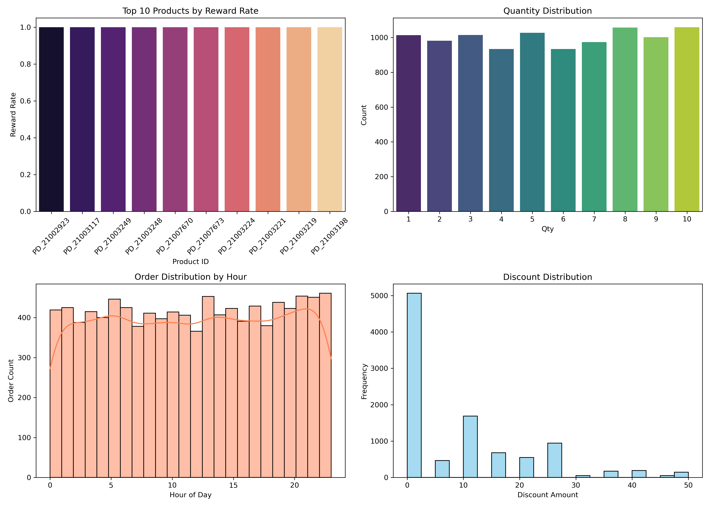

# Ajio_Analysis
# 🛍️ Ajio Data Analysis Project

This project focuses on analyzing transactional data from Ajio to uncover customer behavior trends, product performance, and reward system insights. The analysis includes key visualizations and metrics derived from order-level data.

---

## 📊 Project Objectives

- Understand product-wise reward trends
- Analyze quantity and discount patterns
- Study order behavior by hour of day
- Visualize key KPIs using Python and Seaborn

---

## 🧾 Dataset Description

The dataset contains the following columns:

| Column Name        | Description                            |
|--------------------|----------------------------------------|
| Or_ID              | Order ID                               |
| C_ID               | Customer ID                            |
| P_ID               | Product ID                             |
| Order_Date         | Date of the order                      |
| Order_Time         | Time of the order                      |
| Qty                | Quantity ordered                       |
| Coupon             | Coupon code used                       |
| DP_ID              | Delivery Partner ID                    |
| Discount           | Discount applied on order              |
| Tr_ID              | Transaction ID                         |
| Transaction_Mode   | Mode of payment (e.g., UPI, Card)      |
| Reward             | Reward amount                          |
| Hour               | Hour extracted from Order_Time         |
| Coupon_Used        | Binary flag if coupon was used         |
| Reward_Flag        | Binary flag if reward was given        |

---

## 📈 Visualizations

The following merged dashboard was created as part of this project:

- **Top Products by Reward Rate**
- **Quantity Distribution**
- **Order Hour Distribution**
- **Discount Amount Histogram**

---

## 🛠️ Tools & Technologies

- Python 🐍
- Pandas
- Seaborn
- Matplotlib
- Jupyter Notebook

